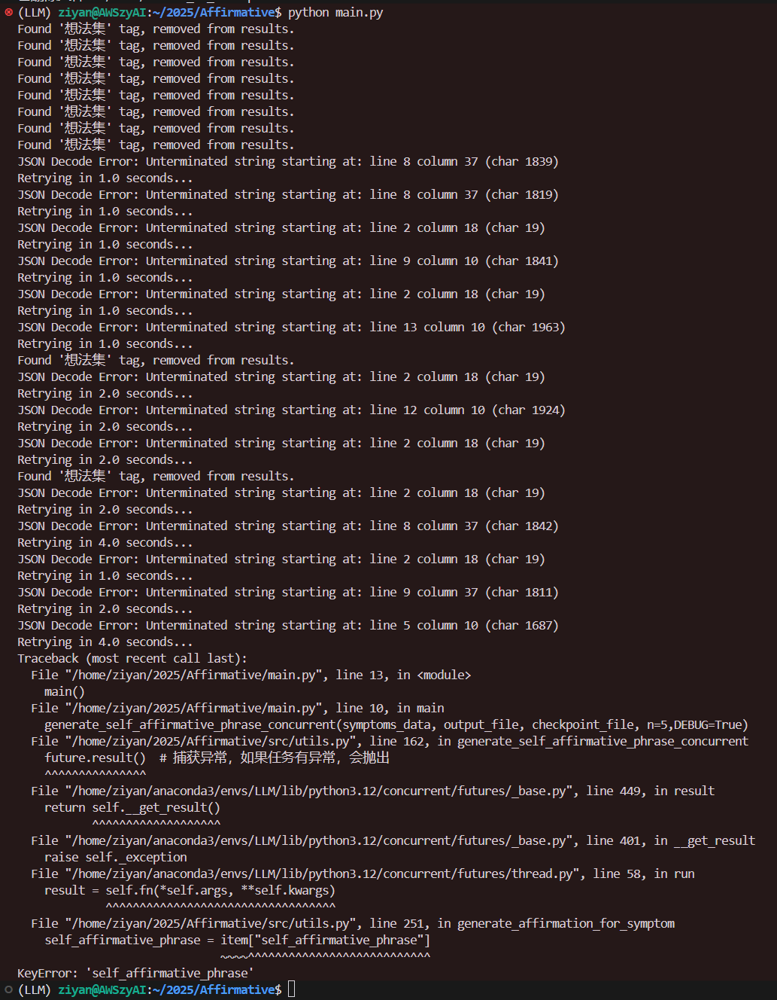

# I-am
Caritas 自我肯定语内容生产

`.env`
```
KIMI_API_KEY = sk-Ar
ZHIPU_API_key = 65
Token = b
```

```bash
pip install -r requirements.txt 
python main.py
```

## Log


句子

### 2025-01-25
1. 拗口 
2. 30字？

1. 每句最多只允许一个比喻


```
{
  "prompt_template": {
    "groups": [
      {
        "group_name": "基础肯定组",
        "description": "建立自我认同基础，使用进行时态与存在性肯定",
        "examples": [
          "我选择相信：此刻的我，正在成为更好的自己",
          "我的存在本身，就是值得庆祝的奇迹"
        ]
      },
      {
        "group_name": "力量唤醒组",
        "description": "通过具身隐喻唤醒内在能量，强化生理-心理联结",
        "examples": [
          "深呼吸时，我能感受到身体里住着一座火山的力量",
          "当世界在摇晃，我的双脚正在生长新的根系抓紧大地"
        ]
      },
      {
        "group_name": "温暖自洽组",
        "description": "运用现代生活意象实现自我接纳，消解完美主义焦虑",
        "examples": [
          "允许自己像云朵有时松散有时流动，存在就是完整的形状",
          "今天的我足够好，像充电到60%的手机，既有休息的权利也有继续闪光的底气"
        ]
      },
      {
        "group_name": "即时赋能组",
        "description": "结合具体动作指令，将肯定转化为可操作步骤",
        "examples": [
          "现在对着镜子说：我比昨天多勇敢了一点点",
          "把『我不行』揉成纸团投进『再试一次』的废纸篓，手掌重新张开时有光落进来"
        ]
      },
      {
        "group_name": "未来锚定组",
        "description": "用科技意象连接当下与未来，构建希望叙事",
        "examples": [
          "我正站在未来更好的我拼命往回发送信号的路上",
          "每个『暂时还没』里都藏着『即将到来』的Wi-Fi信号，我正在接收这些希望"
        ]
      }
    ],
    "style_requirements": {
      "language": "现代白话文风，适当融合科技生活隐喻",
      "structure": "3行以内，单句不超过15字",
      "rhythm": "自然押韵，避免刻意对仗",
      "psychology": "必须包含「我」主语+积极动词+希望意象",
      "sensory": "每句至少包含1个触觉/光感意象"
    }
  }
}
```


### 2025-01-24

1. 只拆逻辑
2. 带需求+逻辑 + 文章
3. 关心需求+改表达

4. 分开处理1级需求和2级需求

5. 句子 附带 级别
    1. 1级：自我安慰，自我接受
    2. 2级：自我鼓励，自我认可
    3. 3级：英雄主义
6. 易读性 读起来累
7. 3个分别query
    1. 逻辑拆解、300字，一个完整的过程
    2. 需求、材料、论证逻辑出句子
    3. 改表达、风格、柔和 降级到1级


```json
[
    {
        'id': 3639, 
        'distance': 0.46352270245552063, 
        'entity': {
            'last_update': '2021-04-11', 
            'content': '', 
            'read_count': 247, 
            'zhihu_link': 'https://www.zhihu.com/pin/1364700155837534208', 
            'author': '#Anonymity', 
            'question': '不知有多少鼓励的话，其实在将来会逼人自…', 
            'links': '', 
            'tags': '["想法集"]', 
            'id': 3639, 
            'favorites_count': 20, 
            'title': ''
        }, 
        'model': 'article'
    }, 
    {
        'id': 1644, 
        'distance': 0.3170081675052643, 
        'entity': {
            'last_update': '2021-09-05', 
            'content': '', 
            'read_count': 1230, 
            'zhihu_link': 'https://www.zhihu.com/question/484883057/answer/2104662616', 
            'author': '#Anonymity', 
            'question': '我们有没有资格安慰别人？如果有，该如何安慰？', 
            'links': '["同情的资格","以弱悯强","误解","赞美","批评与赞美"]', 
            'tags': '["1-家族/1B-处世/2-外务/2d-文责意识","1-家族/1C-安全/2-救助ta人","3-信仰/3A-Caritas/1-爱","1-家族/1E-两性/1-亲密关系/1a-交往准则/社交红线","1-家族/1A-内外/1-内在建设/1f-概念定义","处世"]', 
            'id': 1644, 
            'favorites_count': 84, 
            'title': '安慰'
        }, 
        'model': 'article'
    }
]

```

### 2025-01-23 
1. ✅ Macbook VScode SSH服务器 // 使用Github + 本地VScode/Codeserver
2. ✅ Response is not valid JSON // 使用多轮对话+短Prompt
3. ✅ CoT 光思不改，反思不正确//使用多轮对话
4. ✅ 并发之后不知道进度条
5. ✅ 逻辑拆解、理解材料，结合材料使用其中的事实描述和价值观逻辑来生成孤立语，去掉因为，
6. ✅ 作者风格：遍历一遍各种作者 余华，季羡林，老舍，鲁迅，


### 2025-01-22
1. ✅DEBUG=False时出现死锁
2. ✅症状 -> 需求 
3. ✅只删不增 不一定要求5条
4. 反思出来有问题但是不改：写一版思考日志的详细模板，重复每个问题，下指令要求修改
5. 季羡林
6. 翻译腔 改不掉

⚠️
1. 太多Response is not valid JSON了
    - 
2. Macbook VScode SSH服务器
3. CoT 光思不改，反思不正确//不反思了？
4. 并发之后不知道进度条
5. 检索到的金句不是文章原文
原文不适合摘抄 逻辑、视角、
逻辑拆解、理解材料，结合材料使用其中的事实描述和价值观逻辑来生成孤立语，去掉因为，
6. 作者风格：遍历一遍各种作者 余华，季羡林，老舍，鲁迅，
7. 多轮对话，拆分思考

解读：原文转换出来的对句子的解读，案例，论证为什么xxx。第一人称该写的宣言？

### 2025-01-21 
1. ✅高级生产员
2. ✅引入文章
3. ✅文风 kimi qwen 柔和 柔美 
4. ✅5001：鼓励语生成器 批评过滤器
5. 重启，❌VScode SSH

1. 太多Response is not valid JSON了
2. Macbook VScode SSH服务器
3. CoT 光思不改，反思不正确//不反思了？
4. 并发之后不知道进度条
5. DEBUG=False时出现死锁

问题：
1. 检索到的金句：不是原文
2. 余华风格：会增加负面描述：对齐、识别出来、删掉
3. 反思出来有问题但是不改：写一版思考日志的详细模板，重复每个问题，下指令要求修改
4. 强制5条会无中生有：只删不增 不一定要求5条

ToDo
1. 反思日志导出为结果
2. 
症状 -> 需求 
负面 -> 正面 

句子级别的差异：(1)被安慰/(2)被鼓励改变和行动 -> 有效性

试一下 只用【子场景用户1级需求合并	子场景用户2级需求合并】生成，取消症状

5个1级需求  5个2级需求  这是1/2级需求
安慰效果    鼓励效果


余华没救了，不用余华了。删掉